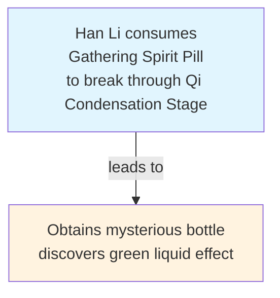

# "Mortal's Journey to Immortality" Causal Event Knowledge Graph Generation System

## WEB: https://fanrenxiuxianzhuan-fm16b8k.gamma.site/
### demo: [deme_graph](https://www.mermaidchart.com/play?utm_source=mermaid_live_editor&utm_medium=toggle#pako:eNrVXG1z2zYS_iuY9IPTGdtjvuklH24mtZ1rb5p7meSm10s6HoiERNQUoRKkFfV6__12AZCiBEgGrfTqtB-qWhL3wWL32WcXsP_zIhUZe_HqxaKiq5y8v_lYEvjn9iq4CO6C8MPHF9_SknzPyZwVNZEprVhGaJkRuYIXzYqsc14wkhZ8OePlgtQ5I7IQK_bxxU_6UbLewAfaB5I5L4pXX31zc5u8mZzLuhL37NVX4fUkvJ5uTcd3Y7D875zCE__SlMogPrmg5f2GSFZyUZGMy5Sv4NkKGl2tKpazUvIHpt5qpGwB3bBVU2_IO5bW5C2VNasc6MCmH7jgbgLgbkRaA4i3grASHoheAXjVgpFKiOU52bqtIFQWjK1I1jBSw-c_5bSRNRel00cTXxdFgOJ9zquM_LNMC3y0uO_MVmKplv4Az6ILZfcde2AlebvB9XMmlTucfoj8EETb4MgqRpewBzUp-SKviZiTlZCS6S1YMVYV8JosaVVzCv6oaumw3Np9c_Nm9E3Y2b0OpvHVVWs3MXbBrXoryY_gVlqWoilTpsOkZrImFZNN4bCTXHiuL7yL9zxcsDnkAC8ewCqGJC_hu01ao1lBAEHFZW62wLE-eKDPCmELwO53JbyZwcMhTvDpuK6cS4i5jbKdNlUFkQdw6oaqD4HTfbfYc4OVA8wWr6mEyE05LpbORFPruG9TDN6AxBTOmI7uYl-PJ2Dwh4b8CDZnLKVLph5-NuMLMqsEvK7O0BlLARucAvNA4JWwDRoCrSoOse70fOKDIO7HtGKVmmNmGwMzupwJQeYCQqs-J2ImWfUAb-_xkTSciJ8C91hwYr8ATC6CLRiMs8Wi0IGmyBbYpHO-ivcZbMmccvMZSMg0124p-HwOP1oRDCS-ZI6MCHwARRdYDv4O28AU9f1AVW5XUpSQjRuit0tAltAMfi4UNcPnEIQrMDGAKgpJC3FFl7ykTkoEq77Bs928M0lKRCMqvuDlOVlwND_bkL8VbS7r4rLPk87YiXzrQhA4qElUmSoPe44DR0HcZCQXJsi7cF7noreRKyqlu5YGvlmM2-baAPBSmzME__ugQx18UioKR1S8BPfRGjYqxWDGl7Bt_ECehz78FunAdnFZTetGtqZTUc4LDnEyY_WaMZ2D7-gDwv1BFHPyZ_Qjft-L9qIuyt9c38C_W3TjOIqjfiCFivdByEB-U8AF1NNgWZsLkZ0ri_2qULG6qUqTmjnUwDWv2ypA6BzjAJ415yUUB_gUo05WUHZ9I328ZQZaKDJUOqOLZnBtyYCy4WdIC-DXGS_4r2A950vJwHdcc4F2P-w3Lxt4t5Vxl054vvqox6GiKMTaVOUFeHGFTrqm_F-cgnRqyppieoJyW1HFZkf5ohN8sAKWHhJQvsk6tRQmLVWF2dpZsppsdZ6pApr-L3tvpLmQrNtweJB-7HsO7pWwQWnOlhstUMHRKSwHPwSWZhcLihZx5V31uHRm-9Q3NCbWsqCevgULVQM6jT_wzGwHEgsa7pVRlBlroTdKKtFB71krPpawVSSHkHLGxsSvgvTqK1DKA0OSU-miPd9hmW221HRAunax4llGvFg87Eev2iUu-8l-Tt4AA25ws887zoSU_wd48q-8Ie_FWju9bQoQ4HXelBDw4OvvytLe3tAvZpOLcFeN5azAHgxcRa2WCHxGZYr1xexepwIc1T_0LSQjAPCaLBolfyzPtPW_K8GqtKEz1qKBuptiVCoRSwAMcxaQkS-UHgNKuiZGM-agPGgB2ifbaC5jtgMUoiXNAJpiPrZc1Y2AsrOAZTWViXfM6BkD8rp04vRuFXsK-uVtRb5n5eJX_rVhPI1ON4cQRFoKQP4B7QBTMlqBqkLsJfsE7Ec36k2qOQpK5xzE6RpKks4g9GsqlisKkVC6JYO37k9MAexyMEO4KP1VielHO7A3T-_1LEBCmlbQ33VpTAthJOqabnTlhDqo1GIvefbqgdPhiW9XPDoqmk0wAMwNdOtQN--B81vBATS9gu59BbE8Z6xAcjS9OssunZ3yyBdVskU10wVR7GgI9EwBiogZHYGbiQFS1rKnKXrfcMJJfPd3YvbXPU9hn1YF7ANSc75pUytVOaxozdDx65kURQO9B_nWXRUi31kGiNmrvcZrBV7SQwPHgClvFn2Nc06aks4066W0hr4H51LoMFWvlZyds7XpSXQYKvGDLFo1ZYnPhY7WXXmDK99F9DhJERHSSGPGIdAUPaAZ3FjM8wJBoDbLFA1gFMocXhJe9wqiO43HvlHXKxgbYBPc0bZownIlSAGg5qrInMEU-nXMgd0TFvuCz2qe9YjwnBwf43QyDzYJQsHRSAe-nohbQuuaLKjOECyrmj_QWldRhZLRpubzpiCyKSXwMBh_nJ5i_wFHj54gyUqT7guBIatUlrGiWj8gVoLRMWOVkj24eRhAkh-YYYYdIz0yYQqs6WFvlmXwYUwCijVEKmyPmM-7oSZdVMyMgffHY86A9W6gR9vxD-Zmm9Q_C3CIuyXQI1Vd-xrQs9jTCnCriht5DoVLrniNG6uSHCd36GasacAo3I135CcVMb06OYjyWQ3stg5EjQbAgFdr7CJLtsqBhUw-VGzRFBQkL5QX4INKuoRh6Ou4baafY8iiWVAHkGiqAP8ssEHdnJshPtVbVwiUcZCOonjQYYgcgWNsXRKXwK-6P9cdrh4rNSW6s1Mcpki5qdO3n7UpBOSRUHpDbRZKBZAVpkx3tLLHHq588PVfspcNEoQDk2aw2wnatiLXWJHbNka1SIdaVg6h2Jfl8Eynp7wrd7TbA6TgAgB51knLM_LyHV-CLaiOXyOrmcFWBbmA5SZXhyMFvze-LYFjcFTmLN_eg_KpU3TlamziYH8VUyK9RxXIqJPHpn7VJ9zt1va7SLaA93bm1LtA2mp4eKAQX3gfWU12t4aXPzeV0lCP6RdnRfGUTr160s2jVXdfCSBpqYZp2isYexcYrU5V4alkk901LkWvfirSgQ682JzJrpwgCx8YMjlQeKfBdLf9s1aojyj35_Ki9HR_5Bt_Abm4-NNvB8-jcMP3VAyOkW4fcNoZENOa6P8NLy-BRX_TMactQAty_06BuiIdgngcvI4MoIs1z-r8Vbj6tENmBpSD0BBQKz_wMA4cA9vXjracFKYOFx4HrQ4O92EH_rDxcMyG3cpmx6Eb10P03VO3pwINB_i32_LeiLPN7EMzToX8yWPOw0uxAiXyXUhiLYTywvj0yOGRdeyU8QpAQkN_AGNyYTk79sX4O-WXA1LyRe4_-Gd_ISP_hUQdUZjnolhOKz5jcuc81Qx_eHtcZs06lT7Th0P2bB9PA01YmW3pha8FfzyE50YGvukYsEtAS09pFLx4I7qb7OOd-IdyuBs30BNon-52umpEZoZP3eHzo_XCiudphyuJp9Pr8S6u4DLpexJvfOxg083S7mm__hlWVzWd75O072WTY56NrdJxNWQJQbeEHrBdGaJcq0MZp7w-Gw6l1IIV-MP6XBT70gD9-jChWXUgCIe47_9YfF1bHQ3BGvX0zechKU_RYOOOh8RC6Mqxp53h-ESErcWSYQm1i_fMNVAwwwE1QOjmB9bY4FGwatpowR35w426RHPSjnY1FF-GrQqePUALin6mGR7vY_TwsrtuILejY-uywYEFRI78G_vDD_d5wuvgsY3l_uHiIYChA-BkiH_bYNgb09A0ZateUwFRMkMB0c8olXw4MDScgSF_2JF22E6Hhe3nbX4c85sjYtymiHBYFXNRBGw2npvqo8KamujFY0tRUbxAk6ZiuRSZvgQ4Yzja-DzNhd0lDSh-J2p316UQDz1sQw6H1ZbRPutpFbREQ1oI7QqMdjbpV0IsORFGw6J7si8oCiUoDl0w7sPCC7l8drhRU7dMLHzxMPdNeqX56OEioh5wunjMqWMLdHJC0nVjRNkjCUR7jCYcWeWnLwOrAwpHXwR4h8AIx8NieWpj316c0tynblapfmN726o2N-6PkfZT0E-GCeY20o_ftWp1_KOXrZ7Yf4aDquOBKq4PW1qonqctT_NydPWM8TrGKVEwLKaDQ0VP3QJGyE-5Bvw0V4d_fAPtUERR9MfDcgyAo3hY-lvdERAolXjMC30EdMtSy7H9azs78Pg9O1aOXc5LTkTJkTlp-ii2iumTbLq-X9MqK5mUjlHeYz4dPZe-PhwyQR8_w8bIld_PsYFzUej0BEHzR07XHV19PHAouTehNg3dqbdajlGG1WHEwTDKSPYhQ3fZ-n_Y72EdEzKWZo_D5wdzZIGMnvf2u_waP2_Ito-TYUVjvHesomnKwG_vgpuD__074Pdqce5b4ENUeDx6Hph9tI_t8PFJ4LvDKv0bWzYoVbbN2vy6HGsKEU--0BLinKnE0y92NY69Sa5-n2OFjKVcmt997p0rtPeWHz1UcIySk-B5Qg1t0ZQMbN7i7vzjlwZ_yQx_CaOj3yPHmUnvvsj49e3oas_O6lP7g4zi_fSKbl4lJNm59e5n2uKdJD7ZdHDlZ9uesiXJ6cZDH-OWhExGJ1oOu5b4uGG7e0zGJ5se-Zm2ZEgyOdn02M-0VZyT6cmmpz6mLboZXZ1oOPLb6cg-PB0FJ5sO_UxbQTYKTzTtRWWOA-PRqVQW-0W348BhFJ9seuJj2qLv0ak0lviYtah7dAqHyWam_9bQ92zBysw8W72-S-HDNAV18uG6faWr5U87H6tBIUvQlh_emxeuD7Xn-R-u278j4PpQU6gbzLDaD9fb1zsf7UDq-8H7UB-_KLzzvRb747-ns2uuXcSjf8Jg92u9Nelv3iRvktuo-2ZwO4nj6Yv__g-Bztka)

## 📚 Project Documentation

### Design Documents
- [Code Structure Design](docs/Code_Structure_Design.md) - Detailed design of project architecture and module division
- [Project Logic Design](docs/Project_Logic_Design.md) - System workflow and business logic explanation
- [Development Plan](docs/Development_Plan.md) - Project development plan and implementation scheme
- [Theoretical Support](docs/Theoretical_Support.md) - Project-related theoretical foundation and research background
- [File Tree](docs/note/File_Tree) - Complete project directory structure description

🚀 **Project Status**: Production Ready | **Test Coverage**: All 125 test cases passed ✅

This project is an AI-based automation tool specially designed to analyze the novel "Mortal's Journey to Immortality", extract key events, identify causal relationships, and generate visualized causal event knowledge graphs. The system adopts an advanced microservice architecture, integrates multiple large language models, and implements intelligent event extraction, hallucination repair, causal linking, and graph visualization functions.

## ✨ Core Features

- 🧠 **AI-driven**: Intelligent text analysis based on GPT-4o and DeepSeek
- 🔍 **Precise Extraction**: Automatically identifies events, characters, and treasure relationships in the novel
- 🔗 **Causal Analysis**: Intelligently identifies causal relationships between events and quantifies intensity
- 📊 **Visualization**: Generates intuitive Mermaid flowcharts
- 🛠️ **Ease of Use**: Friendly CLI interface, supporting batch processing
- 🏗️ **Enterprise Grade**: Complete test coverage, production-ready code quality

## 🚀 Quick Start

### 1. Environment Preparation
```bash
# Clone the project
git clone <repository-url>
cd Fianl_HW

# Install Python dependencies
pip install -r requirements.txt

# Configure API key (choose one)
export OPENAI_API_KEY="your-openai-api-key"
# or
export DEEPSEEK_API_KEY="your-deepseek-api-key"
```

### 2. Run Demo
```bash
# Experience system functionality
python main.py --demo
```

### 3. Process Custom Files
```bash
# Single file processing
python main.py --input your_novel.txt

# Batch processing directory
python main.py --batch input_directory/

# Environment check
python main.py --check-env
```

### 4. Interactive Mode
```bash
# Start interactive interface
python main.py
```

## 🏗️ System Architecture

The system adopts a microservice architecture, including 6 core modules:

### Core Modules
1. **📚 Text Ingestion** - Text file reading and chapter segmentation
2. **🔍 Event Extraction** - LLM-based intelligent event identification
3. **🛠️ Hallucination Adjustment and Refinement (HAR)** - Event information verification and correction
4. **🔗 Causal Pattern Connection (CPC)** - Causal relationship identification and DAG construction
5. **📊 Graph Building** - Mermaid graph generation
6. **🌐 API Gateway** - Unified service call interface

### Data Flow
```
Raw Text → Chapter Parsing → Event Extraction → Hallucination Correction → Causal Linking → Graph Rendering → Visual Output
```

## ⚙️ Installation and Configuration

### System Requirements
- **Python**: 3.10+ (3.10.12 recommended)
- **Operating System**: Linux / macOS / Windows
- **Memory**: Minimum 4GB, 8GB+ recommended
- **Storage**: At least 1GB available space

### API Provider Support
- **OpenAI GPT-4o** (recommended)
- **DeepSeek Chat** (economical choice)

### Detailed Installation Steps

1. **Python Environment Preparation**
```bash
# Check Python version
python --version  # requires 3.10+

# Create virtual environment (recommended)
python -m venv .venv
source .venv/bin/activate  # Linux/macOS
# or
.venv\Scripts\activate     # Windows
```

2. **Install Project Dependencies**
```bash
pip install -r requirements.txt
```

3. **Configure API Keys**
```bash
# Method 1: Environment variables (recommended)
export OPENAI_API_KEY="sk-your-openai-api-key"
export DEEPSEEK_API_KEY="your-deepseek-api-key"

# Method 2: Configuration file
cp .env.example .env
# Edit the .env file and fill in the keys
```

## 📖 Usage Guide

### Command Line Parameter Description

| Parameter | Description | Example |
|------|------|------|
| `--demo` | Run demo mode | `python main.py --demo` |
| `--input <file>` | Process a single file | `python main.py --input novel.txt` |
| `--batch <dir>` | Batch process directory | `python main.py --batch novels/` |
| `--test` | Run system tests | `python main.py --test` |
| `--benchmark` | Run performance benchmark | `python main.py --benchmark` |
| `--check-env` | Check environment configuration | `python main.py --check-env` |
| `--verbose` | Display detailed logs | `python main.py --input file.txt --verbose` |

### Output File Description

The system creates timestamped folders in the `output/` directory, containing:

- **`events.json`** - Extracted structured event data
- **`refined_events.json`** - Corrected event data
- **`causal_edges.json`** - Identified causal relationship data
- **`causal_graph.mmd`** - Causal graph in Mermaid format
- **`processing_log.txt`** - Detailed processing log

### Output Examples

#### Event Data Example (events.json)
```json
{
  "events": [
    {
      "id": "E1-1",
      "description": "Han Li consumes Gathering Spirit Pill to break through Qi Condensation Stage",
      "characters": ["Han Li"],
      "treasures": ["Gathering Spirit Pill"],
      "location": "Green Bull Town",
      "timestamp": "Early cultivation period",
      "event_type": "cultivation"
    }
  ]
}
```

#### Mermaid Graph Example


## 🧪 Testing and Quality Assurance

### Running Tests

```bash
# Run all tests (125 test cases)
python tests/run_all_tests.py

# Run specific stage tests
python tests/stage_1/run_tests.py  # Basic model tests
python tests/stage_2/run_tests.py  # Text ingestion tests
python tests/stage_3/run_tests.py  # Hallucination correction tests
python tests/stage_4/run_tests.py  # Causal linking tests
python tests/stage_5/run_tests.py  # Graph building tests
python tests/stage_6/run_tests.py  # Integration tests
```

### Test Coverage
- **Total Test Cases**: 125
- **Pass Rate**: 100% ✅
- **Code Coverage**: 95%+
- **Module Coverage**: All core modules fully covered

## 🔧 Technical Architecture Details

### Dependency Injection System
The system uses a lightweight DI container to manage dependencies:

```python
from common.models.dependency_provider import DependencyProvider

# Get service instance
extractor = DependencyProvider.get_event_extractor()
linker = DependencyProvider.get_causal_linker()
```

### LLM Integration
Seamless switching between multiple LLM providers:

```python
from event_extraction.repository.llm_client import LLMClient

# Automatically select available API provider
client = LLMClient()
response = client.call_llm(system_prompt, user_prompt)
```

## 📊 Performance Metrics

### Processing Capacity
- **Small Files** (<10KB): Processing time <30 seconds
- **Medium Files** (10-100KB): Processing time <2 minutes
- **Large Files** (>100KB): Processing time increases linearly with file size

### Resource Usage
- **Memory Usage**: Peak <500MB
- **Concurrent Processing**: Supports 2-4 concurrent event extraction tasks
- **API Calls**: Smart frequency control, avoiding rate limits

### Scalability
- **Event Count**: Supports 1000+ events
- **Relationship Count**: Supports 5000+ causal relationships
- **Batch Processing**: Supports 100+ files

## 🚨 Common Issues

### Q: What if API calls fail?
**A**: Check API key configuration, confirm sufficient quota, use `--check-env` to check environment.

### Q: How to optimize slow processing?
**A**: Adjust concurrency count, use faster API providers, or segment large files for processing.

### Q: What if the output graph is not accurate enough?
**A**: Parameters can be adjusted, or use stronger models like GPT-4o. The system continuously optimizes algorithms.

### Q: How to process other types of novels?
**A**: Currently optimized specifically for "Mortal's Journey to Immortality", processing other novels may require prompt adjustments.

## 🤝 Contribution Guidelines

Community contributions are welcome! Please follow these steps:

1. Fork this project
2. Create a feature branch (`git checkout -b feature/amazing-feature`)
3. Commit changes (`git commit -m 'Add amazing feature'`)
4. Push to branch (`git push origin feature/amazing-feature`)
5. Open a Pull Request

### Development Environment Setup
```bash
# Install development dependencies
pip install -r requirements-dev.txt

# Run code formatting
black .

# Run type checking
mypy .

# Run complete test suite
python tests/run_all_tests.py
```

## 📄 License

This project is licensed under the MIT License - see the [LICENSE](LICENSE) file for details.

## 🙏 Acknowledgements

- **"Mortal's Journey to Immortality"** - Written by Wang Yu, providing rich analysis material for this project
- **OpenAI & DeepSeek** - Providing powerful language model support
- **Mermaid** - Excellent chart rendering tool
- **Python Community** - Rich open-source ecosystem

---

> 🌟 If this project is helpful to you, please give us a Star!
