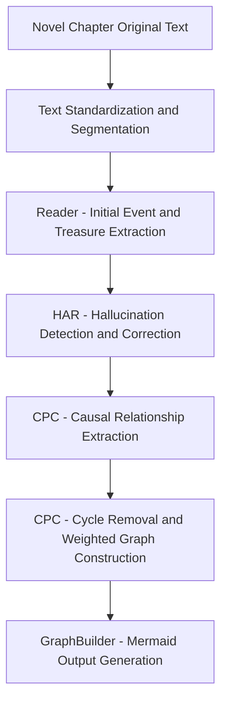
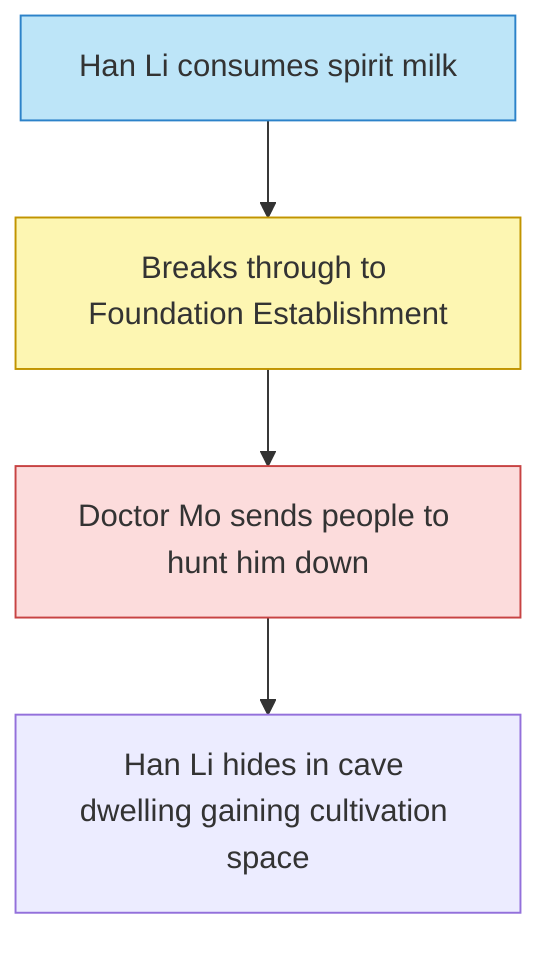

# Project Logic Design

Below is the **complete system-level workflow detailed design** for your project (automatically generating a causal knowledge graph of "treasures + major events" from "Mortal's Journey to Immortality" based on the R2 framework), from input to output, with each link including:

- Module name
- Required input/output format (with fields)
- Technology/model/algorithm used
- Example data and processing logic
- Checkpoints and error control mechanisms

---

# ✅ Top-level Workflow Overview (Overall Pipeline)



---

## 🔹 STEP A0: Raw Text Preparation

- **Input**: Original novel txt file (e.g., complete "Mortal's Journey to Immortality")
- **Task**: Chapter segmentation cleaning + standardization to JSON format

### Input Example (raw):

```
【Chapter Fifteen: Gathering Spirit Pill】
Han Li took out a spirit milk from his storage bag... He felt spiritual energy surging...

```

### Output Format:

```json
{
  "chapter_id": "Chapter Fifteen",
  "title": "Gathering Spirit Pill",
  "content": "Han Li took out a spirit milk from his storage bag..."
}

```

---

## 🔹 STEP A1: Text Standardization and Segmentation

- **Input**: Original chapter text
- **Output**: Structured text roughly divided by paragraphs/events
- **Processing Method**: Sentences divided by blank lines/punctuation, maintaining logical integrity

### Output Structure:

```json
{
  "chapter_id": "Chapter Fifteen",
  "segments": [
    {
      "seg_id": "Chapter Fifteen-1",
      "text": "Han Li took out spirit milk and consumed it..."
    },
    {
      "seg_id": "Chapter Fifteen-2",
      "text": "Han Li felt his meridians heating up..."
    }
  ]
}

```

---

## 🔹 STEP B1: Reader - LLM Information Extraction

- **Input**: Chapter segmented text
- **Task**: Extract events, treasures, characters from each text segment
- **Model Used**: GPT-4o / Claude 3
- **Output**: Structured event items (each segment → multiple events)

### Example Prompt:

```
Please extract key events, involved treasures, characters, and the results and background of events from the following novel paragraph, output in standard JSON structure.

```

### Output Format:

```json
{
  "event_id": "E15-2",
  "description": "Han Li consumes spirit milk to break through to Foundation Establishment",
  "treasures": ["Spirit Milk"],
  "characters": ["Han Li"],
  "result": "Cultivation advancement",
  "location": "Inside cave dwelling",
  "time": "Night time"
}

```

---

## 🔹 STEP B2: HAR - Hallucination Detection and Refinement

- **Input**: Event extraction results + supporting context
- **Task**: Detect factual errors, language inconsistencies, concept confusion
- **Implementation**:
    - LLM outputs "potential hallucination locations" + repair suggestions
    - Use `prefine prompt` for rewriting
    - Merge rewritten results → update event information

### Example Detection Result:

```json
{
  "loc": "event.treasure",
  "suggestion": "'Five-colored Spirit Milk' should be 'Spirit Milk', Five-colored Spirit Milk appears in later plot"
}

```

---

## 🔹 STEP C1: Causal Pair Extraction (Causal Relationship Identification)

- **Input**: All cleaned events
- **Objective**: Discover causal pairs between events and determine strength
- **Implementation Method**:
    - Use "two paths, merge confluence" strategy to generate candidate event pairs
      - **Path One**: Same chapter event pairing - capture tight causal relationships in local context
      - **Path Two**: Cross-chapter entity co-occurrence pairing - capture long-distance causal relationships, using entity frequency weight inverse adjustment
    - Each two event pairs as prompt input
    - LLM determines if there is a causal relationship and provides strength label (high/medium/low)

### Entity Frequency Weight Inverse Adjustment:
- **Problem Background**: High-frequency entities like "Han Li" appear in many events, causing candidate event pair explosion
- **Optimization Strategy**: Assign low weights to high-frequency entities, high weights to low-frequency entities
- **Weight Formula**: `weight = 1 / log(frequency + 1.1)`
- **Complexity Comparison**:
  - Before optimization: O(N²) all events paired with each other
  - After optimization: O(N·avg_m²) + O(E × k²) where N is number of chapters, m is average events per chapter, E is number of entities, k is events related to each entity
- **Actual Effect**: About 88% reduction in candidate pairs in testing, from 435 pairs to 51 pairs

### Prompt Fragment Example:

```
Event 1: Han Li consumes spirit milk to break through to Foundation Establishment
Event 2: Doctor Mo feels threatened, orders assassins to hunt down Han Li
Is there a causal relationship? If so, please explain the direction, strength, and briefly explain why.

```

### Output Format:

```json
{
  "from": "E15-2",
  "to": "E15-3",
  "strength": "high",
  "reason": "Cultivation advancement caused suspicion and hostility"
}

```

---

## 🔹 STEP C2: CPC - DAG Construction (Cycle Removal + Weighting)

- **Input**: List of causal pairs
- **Objective**: Build a Directed Acyclic Graph (DAG), avoid contradictory cycles
- **Algorithm**: Greedy cycle breaking (weight priority + indegree sorting)

### Internal Logic:

1. All events as nodes
2. Event pairs sorted by strength: high > medium > low
3. If an edge forms a cycle → delete weaker edge
4. Finally form a minimum covering strong causal chain graph

### Output Structure:

```json
{
  "nodes": ["E15-2", "E15-3", "E15-4"],
  "edges": [
    {"from": "E15-2", "to": "E15-3", "strength": "high"},
    {"from": "E15-3", "to": "E15-4", "strength": "medium"}
  ]
}

```

---

## 🔹 STEP D1: Mermaid Graph Output Module

- **Input**: DAG graph structure (nodes + edges)
- **Task**: Render the graph in Mermaid format and mark node types
- **Implementation Method**:
    - Node colors distinguish types (treasure events/character actions/hostile conflicts)
    - Can add click links / tooltips (supported by Mermaid)

### Mermaid Output Example:



---

## 🔹 Checkpoint Design (Breakpoint Verification for Each Step)

| Step | Verification Method | Error Handling Suggestion |
| --- | --- | --- |
| Text Segmentation | Chapter count/check for garbled text | Use title matching breakpoint rollback |
| Event Extraction | Check for empty fields | Fall back to using standard prompts for another round |
| HAR Correction | Consistency with supporting text | Mark with "unresolved" flag for manual review |
| Causal Identification | Check for duplicates/self-loops | Automatically remove invalid edge pairs |
| Mermaid Generation | Check format compliance | Validate Mermaid syntax before output |

---

## 🔚 Summary: Complete Processing Flow (Final Version)

```mermaid
graph TD
    T0[📘 Original Novel Text] --> T1[🔤 Text Preprocessing]
    T1 --> T2[📚 Segmentation + Clean JSON]
    T2 --> T3[🧠 Reader: Event/Treasure/Character Extraction]
    T3 --> T4[🧹 HAR Correction]
    
    T4 --> T5A[🔄 Same Chapter Event Pairing]
    T4 --> T5B[⚖️ Entity Frequency Weight Calculation]
    T5B --> T5C[🔗 Cross-Chapter Entity Co-occurrence Pairing]
    
    T5A & T5C --> T5D[📦 Candidate Event Pair Merging]
    T5D --> T6[📊 DAG Construction (Cycle Removal)]
    T6 --> T7[📈 Mermaid Output Generation]
    
    style T5B fill:#FFECB3,stroke:#FF9800
    style T5C fill:#FFECB3,stroke:#FF9800
    style T5D fill:#FFECB3,stroke:#FF9800

```

> 🔸 **Note**: Orange highlighted nodes represent the optimized process, using entity frequency weight inverse adjustment technique

---
