# 《凡人修仙传》因果事件图谱生成系统

🚀 **项目状态**: 生产就绪 | **测试覆盖**: 125个测试用例全部通过 ✅

本项目是一个基于AI的自动化工具，专门用于分析《凡人修仙传》小说文本，提取关键事件，识别因果关系，并生成可视化的因果事件图谱。系统采用先进的微服务架构，集成多个大语言模型，实现了智能事件抽取、幻觉修复、因果链接和图谱可视化等功能。

## ✨ 核心特性

- 🧠 **AI驱动**: 基于GPT-4o和DeepSeek的智能文本分析
- 🔍 **精确提取**: 自动识别小说中的事件、人物、宝物关系
- 🔗 **因果分析**: 智能识别事件间的因果关系并量化强度
- 📊 **可视化**: 生成直观的Mermaid流程图
- 🛠️ **易用性**: 友好的CLI界面，支持批量处理
- 🏗️ **企业级**: 完整测试覆盖，生产就绪的代码质量

## 🚀 快速开始

### 1. 环境准备
```bash
# 克隆项目
git clone <repository-url>
cd Fianl_HW

# 安装Python依赖
pip install -r requirements.txt

# 配置API密钥 (选择其一)
export OPENAI_API_KEY="your-openai-api-key"
# 或
export DEEPSEEK_API_KEY="your-deepseek-api-key"
```

### 2. 运行演示
```bash
# 体验系统功能
python main.py --demo
```

### 3. 处理自定义文件
```bash
# 单文件处理
python main.py --input your_novel.txt

# 批量处理目录
python main.py --batch input_directory/

# 环境检查
python main.py --check-env
```

### 4. 交互式模式
```bash
# 启动交互式界面
python main.py
```

## 🏗️ 系统架构

系统采用微服务架构，包含6个核心模块：

### 核心模块
1. **📚 文本摄入 (Text Ingestion)** - 文本文件读取与章节分割
2. **🔍 事件提取 (Event Extraction)** - 基于LLM的智能事件识别
3. **🛠️ 幻觉修正 (HAR)** - 事件信息验证与修正
4. **🔗 因果链接 (CPC)** - 因果关系识别与DAG构建
5. **📊 图谱构建 (Graph Building)** - Mermaid图谱生成
6. **🌐 API网关 (API Gateway)** - 统一服务调用接口

### 数据流程
```
原始文本 → 章节解析 → 事件提取 → 幻觉修正 → 因果链接 → 图谱渲染 → 可视化输出
```

## ⚙️ 安装与配置

### 系统要求
- **Python**: 3.10+ (推荐 3.10.12)
- **操作系统**: Linux / macOS / Windows
- **内存**: 最低4GB，推荐8GB+
- **存储**: 至少1GB可用空间

### API提供商支持
- **OpenAI GPT-4o** (推荐)
- **DeepSeek Chat** (经济型选择)

### 详细安装步骤

1. **Python环境准备**
```bash
# 检查Python版本
python --version  # 需要3.10+

# 创建虚拟环境 (推荐)
python -m venv .venv
source .venv/bin/activate  # Linux/macOS
# 或
.venv\Scripts\activate     # Windows
```

2. **安装项目依赖**
```bash
pip install -r requirements.txt
```

3. **配置API密钥**
```bash
# 方式1: 环境变量 (推荐)
export OPENAI_API_KEY="sk-your-openai-api-key"
export DEEPSEEK_API_KEY="your-deepseek-api-key"

# 方式2: 配置文件
cp .env.example .env
# 编辑 .env 文件填入密钥
```

## 📖 使用指南

### 命令行参数说明

| 参数 | 描述 | 示例 |
|------|------|------|
| `--demo` | 运行演示模式 | `python main.py --demo` |
| `--input <file>` | 处理单个文件 | `python main.py --input novel.txt` |
| `--batch <dir>` | 批量处理目录 | `python main.py --batch novels/` |
| `--test` | 运行系统测试 | `python main.py --test` |
| `--benchmark` | 运行性能基准测试 | `python main.py --benchmark` |
| `--check-env` | 检查环境配置 | `python main.py --check-env` |
| `--verbose` | 显示详细日志 | `python main.py --input file.txt --verbose` |

### 输出文件说明

系统会在`output/`目录下创建时间戳文件夹，包含：

- **`events.json`** - 提取的结构化事件数据
- **`refined_events.json`** - 修正后的事件数据  
- **`causal_edges.json`** - 识别的因果关系数据
- **`causal_graph.mmd`** - Mermaid格式的因果图谱
- **`processing_log.txt`** - 详细的处理日志

### 示例输出

#### 事件数据示例 (events.json)
```json
{
  "events": [
    {
      "id": "E1-1",
      "description": "韩立服用聚灵丹突破练气期",
      "characters": ["韩立"],
      "treasures": ["聚灵丹"],
      "location": "青牛镇",
      "timestamp": "修仙初期",
      "event_type": "cultivation"
    }
  ]
}
```

#### Mermaid图谱示例

```mermaid
graph TD
    E1["韩立服用聚灵丹<br/>突破练气期"]
    E2["获得神秘瓶子<br/>发现绿液功效"]
    
    E1 -->|导致| E2
    
    classDef cultivation fill:#e1f5fe
    classDef treasure fill:#fff3e0
    class E1 cultivation
    class E2 treasure
```


## 🧪 测试与质量保证

### 运行测试

```bash
# 运行所有测试 (125个测试用例)
python tests/run_all_tests.py

# 运行特定阶段测试
python tests/stage_1/run_tests.py  # 基础模型测试
python tests/stage_2/run_tests.py  # 文本摄入测试  
python tests/stage_3/run_tests.py  # 幻觉修正测试
python tests/stage_4/run_tests.py  # 因果链接测试
python tests/stage_5/run_tests.py  # 图谱构建测试
python tests/stage_6/run_tests.py  # 集成测试
```

### 测试覆盖率
- **总测试用例**: 125个
- **通过率**: 100% ✅
- **代码覆盖率**: 95%+
- **模块覆盖**: 所有核心模块全覆盖

## 🔧 技术架构详解

### 依赖注入系统
系统使用轻量级DI容器管理依赖：

```python
from common.models.dependency_provider import DependencyProvider

# 获取服务实例
extractor = DependencyProvider.get_event_extractor()
linker = DependencyProvider.get_causal_linker()
```

### LLM集成
支持多个LLM提供商的无缝切换：

```python
from event_extraction.repository.llm_client import LLMClient

# 自动选择可用的API提供商
client = LLMClient()
response = client.call_llm(system_prompt, user_prompt)
```

## 📊 性能指标

### 处理能力
- **小文件** (<10KB): 处理时间 <30秒
- **中等文件** (10-100KB): 处理时间 <2分钟  
- **大文件** (>100KB): 处理时间随文件大小线性增长

### 资源使用
- **内存占用**: 峰值 <500MB
- **并发处理**: 支持2-4个并发事件提取任务
- **API调用**: 智能频率控制，避免超限

### 扩展性
- **事件数量**: 支持1000+事件
- **关系数量**: 支持5000+因果关系
- **批量处理**: 支持100+文件

## 🚨 常见问题

### Q: API调用失败怎么办？
**A**: 检查API密钥配置，确认配额充足，可使用`--check-env`检查环境。

### Q: 处理速度慢怎么优化？
**A**: 可以调整并发数量，使用更快的API提供商，或对大文件进行分段处理。

### Q: 输出的图谱不够准确？
**A**: 可以调整相关参数，或使用更强的模型如GPT-4o。系统会持续优化算法。

### Q: 如何处理其他类型的小说？
**A**: 当前专门针对《凡人修仙传》优化，处理其他小说可能需要调整提示词。

## 🤝 贡献指南

我们欢迎社区贡献！请遵循以下步骤：

1. Fork本项目
2. 创建特性分支 (`git checkout -b feature/amazing-feature`)
3. 提交更改 (`git commit -m 'Add amazing feature'`)
4. 推送到分支 (`git push origin feature/amazing-feature`)
5. 开启Pull Request

### 开发环境设置
```bash
# 安装开发依赖
pip install -r requirements-dev.txt

# 运行代码格式化
black .

# 运行类型检查
mypy .

# 运行完整测试套件
python tests/run_all_tests.py
```

## 📄 许可证

本项目采用 MIT 许可证 - 查看 [LICENSE](LICENSE) 文件了解详情。

## 🙏 致谢

- **《凡人修仙传》** - 忘语著，为本项目提供了丰富的分析素材
- **OpenAI & DeepSeek** - 提供强大的语言模型支持
- **Mermaid** - 优秀的图表渲染工具
- **Python社区** - 丰富的开源生态系统

## 📞 联系方式

- **项目地址**: [GitHub Repository]
- **问题反馈**: [GitHub Issues]
- **邮箱**: your-email@example.com

---

**项目状态**: ✅ 生产就绪  
**最新版本**: v1.0.0  
**更新时间**: 2025年6月10日

> 🌟 如果这个项目对您有帮助，请给我们一个Star！


