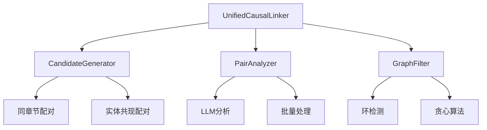

# 因果图生成逻辑分析与优化建议

## 一、当前因果图生成逻辑分析

### 1. 整体流程
1. **文本摄取**
2. **事件提取**
3. **幻觉修复**
4. **因果关系链接**
5. **图谱构建**

### 2. 核心组件架构

### 3. 关键算法策略

#### 3.1 候选对生成优化
- **同章节配对**：O(章节内事件²)
- **实体共现跨章配对**：基于实体频率反向权重
- **复杂度降低**：从O(N²)降到O(N·avg_m²) + O(E × k²)

#### 3.2 因果关系分析
- **并行处理**：使用ThreadPoolExecutor
- **LLM调用**：支持OpenAI和DeepSeek
- **响应解析**：JSON格式化输出

#### 3.3 DAG构建
- **环检测**：深度优先搜索
- **贪心算法**：按强度排序保留强边
- **冲突解决**：移除形成环的边

---

## 二、发现的优化空间和问题

### 1. LLM调用效率问题
- 每个事件对都需要独立的LLM调用，效率低。
- **建议**：实现批量推理、提示工程优化、结果缓存。

### 2. 实体频率权重过于简单
- 仅用频率反比，未考虑语义重要性和实体类型。
- **建议**：引入实体类型区分和语义权重。

### 3. 图过滤贪心策略局限
- 只按强度排序，可能丢失重要因果链。
- **建议**：考虑全局连通性和因果链完整性。

### 4. 章节跨度限制问题
- 固定跨度可能不适合所有文本类型。
- **建议**：动态调整跨度参数。

### 5. 并行处理资源利用率
- 固定线程数可能未充分利用资源。
- **建议**：根据硬件和API限制自适应调整。

---

## 三、具体优化建议

### 1. 智能候选对筛选
- 引入实体语义相似度、剧情重要性评分。

### 2. 多层次图过滤策略
- 局部强度+全局连通性+因果链完整性联合优化。

### 3. 自适应参数调整
- 根据文本特征动态调整候选生成和过滤参数。

### 4. 结果质量评估体系
- 建立因果图覆盖率、一致性、完整性等指标。

---

## 四、关键问题总结

1. **效率vs准确性权衡**：当前优化是否影响准确性？
2. **可扩展性**：能否处理更大规模文本？
3. **通用性**：算法是否过度针对特定小说类型？
4. **鲁棒性**：LLM输出不稳定时如何处理？
5. **可解释性**：因果图是否有足够决策依据？

---

> 该文档总结了因果图生成的主要流程、架构、存在的问题及优化建议，便于后续系统迭代和性能提升。
