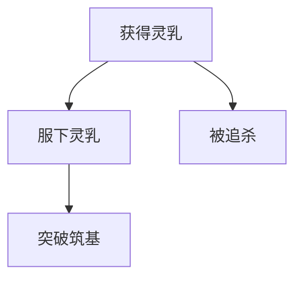

# 📘 问题定义

**目标**：从小说《凡人修仙传》中抽取事件，并构建**因果图谱**
**核心任务**：生成候选事件对集用于送入因果判断（如LLM）
**挑战**：避免 O(N²) 全### ⚙️ 参数调节：

* 实体最小共现数 `min_support`，避免过度配对"韩立"这种高频实体
* 可加入 `max_chapter_span` 限制，避免跨度过大

### 🎯 实体频率权重反向调整：

* **问题**：高频实体（如"韩立"）出现在大量事件中，基于共现会产生过多候选对
* **解决方案**：实体频率越高，其贡献权重越低
* **权重计算公式**：`weight = 1 / log(frequency + 1.1)`
* **应用方式**：
  * 计算每个实体在全部事件中的出现频率
  * 为每个事件对分配权重分数：共享实体权重之和
  * 根据权重对候选对进行排序，保留高权重的候选对
  * 或通过设定权重阈值进行筛选

#### 💡 实现技术细节：

* **实体频率统计**：
  ```python
  entity_freq = {
      entity: len(events_list) 
      for entity, events_list in {**character_to_events, **treasure_to_events}.items()
  }
  ```

* **权重反向计算**：
  ```python
  import math
  entity_weights = {
      entity: 1.0 / math.log(freq + 1.1)  # 避免 log(1) = 0
      for entity, freq in entity_freq.items()
  }
  ```

* **事件对权重累加**：
  ```python
  # 合并共享多个实体的事件对的权重
  pair_weights = {}
  for id1, id2, weight in weighted_pairs:
      pair_key = (id1, id2)
      if pair_key in pair_weights:
          pair_weights[pair_key] += weight  # 累加权重
      else:
          pair_weights[pair_key] = weight
  ```

* **测试效果**：
  * 测试数据集：50个事件，包含多个高频实体（如"韩立"出现在所有事件中）
  * 不使用权重：435个候选对
  * 使用实体权重：51个候选对
  * 效率提升：约88%的候选对减少

### ⏱️ 复杂度：

* 若实体平均涉及 k 个事件，则总组合为 O(E × k²)，E 为实体数量扩展性，兼顾精度与覆盖

---

# ✅ 解决方案逻辑总览（融合式策略）

我们采用“两条路径，合并汇流”的思路：

```
                ┌────────────────────┐
                │ EventItem 数据集合 │
                └────────┬───────────┘
                         │
        ┌────────────────┴───────────────┐
        │                                │
🟦 方法一：同章节事件配对        🟩 方法二：实体共现跨章配对
        │                                │
        └────────────┬──────────────────┘
                     ▼
              候选事件对集合合并（去重）
                     ▼
            送入因果性判定模型（如LLM）
                     ▼
             输出因果边 + 强度 + 解释
```

---

# 🔍 各模块详细逻辑设计

---

## 1️⃣ 输入数据准备：结构化事件集

### ✅ 输入结构：

每一个事件应至少包括：

| 字段名            | 含义       |
| -------------- | -------- |
| `event_id`     | 唯一标识符    |
| `chapter_id`   | 所在章节编号   |
| `description`  | 事件描述文本   |
| `characters`   | 涉及人物列表   |
| `treasures`    | 涉及天材地宝列表 |
| `location`（可选） | 涉及地点信息   |

### ✅ 数据来源：

* 基于 GPT 或人工抽取小说文本片段生成
* 分章节处理，每章生成事件集合

---

## 2️⃣ 方法一：同章节事件两两配对

### 🧠 逻辑目的：

* 捕捉**局部上下文中紧密的因果关系**

### 🎯 匹配条件：

* 两个事件处于同一章节中（chapter\_id 相同）
* 不与自身配对
* 去除顺序对称（只保留 (A, B)，不重复 (B, A)）

### ⏱️ 复杂度：

* 每章 m 个事件，组合数量为 O(m²)
* 总体为 O(N·avg\_m²)，远优于 O(N²)

### ⚠️ 注意事项：

* 应设定上限（如每章最多配对 100 对）避免某章节过长导致过拟合

---

## 3️⃣ 方法二：实体共现跨章配对

### 🧠 逻辑目的：

* 弥补方法一无法覆盖的**远距离因果关系**

### 🧰 实现流程：

1. 为每个实体（角色、宝物）建立**倒排表**

   * 实体 → 涉及它的事件列表
2. 对每个实体相关事件进行**两两组合**
3. 同样去重、去自配、规范方向

### ⚙️ 参数调节：

* 实体最小共现数 `min_support`，避免过度配对“韩立”这种高频实体
* 可加入 `max_chapter_span` 限制，避免跨度过大

### ⏱️ 复杂度：

* 若实体平均涉及 k 个事件，则总组合为 O(E × k²)，E 为实体数量

---

## 4️⃣ 合并候选事件对集合（去重）

### 📦 统一处理：

* 两种来源产生的配对合并为 Set\[(event\_id\_1, event\_id\_2)]
* 可为每对配对打标签（“chapter”、“entity”）
* 用于后续 LLM Prompt 精细化处理

### 🧾 合并策略：

* 去除重复配对
* 可保留顺序（便于 LLM 判断方向性）

---

## 5️⃣ 因果判断模块（LLM / 模型）

### 🧠 输入结构：

* 两个事件的描述文本
* 可选上下文，如所属章节信息、实体交集等

### 🧠 判断目标：

* 是否存在因果关系？
* 因果方向？（A→B 或 B→A）
* 强度？（强、中、弱）
* 理由（生成解释）

### 🧾 输出结构：

```json
{
  "from": "E02",
  "to": "E03",
  "strength": "高",
  "reason": "因韩立服下灵乳，灵力暴涨，进而突破筑基期"
}
```

---

## 6️⃣ 构建因果图谱边集

### 🎯 图结构：

* 节点：事件
* 边：因果方向（有向图）
* 权重：强度（可用于可视化调整边粗细）
* 解释：可用于下游摘要或图谱标注

---

# 📈 整体控制策略

| 控制点                      | 意图                | 建议设定                 |
| ------------------------ | ----------------- | -------------------- |
| `max_events_per_chapter` | 控制配对组合爆炸          | ≤20                  |
| `min_entity_support`     | 跳过高频/低效实体         | ≥2                   |
| `max_candidate_pairs`    | 限制送入 LLM 数量       | ≤10,000              |
| `use_entity_weights`     | 启用实体频率权重反向调整      | true                 |
| `entity_weight_formula`  | 实体权重计算公式          | 1 / log(freq + 1.1)  |
| `weight_threshold`       | 权重阈值，低于此值的候选对被过滤  | 根据数据集特点动态调整         |
| `merge_strategy`         | 控制同源配对去重与优先级      | 并集或优先法              |
| `max_weighted_pairs`     | 使用权重排序后的最大候选对数量   | ≤5,000               |
| `LLM并发处理`                | 提高吞吐量             | ThreadPoolExecutor   |

## 🛠️ 环境变量配置

以下环境变量可用于控制优化策略：

```bash
# API密钥配置
export OPENAI_API_KEY="your-openai-api-key"
export DEEPSEEK_API_KEY="your-deepseek-api-key"

# 实体权重优化配置
export USE_ENTITY_WEIGHTS="true"  # 启用实体频率权重反向调整
export MIN_ENTITY_SUPPORT="2"     # 实体最小支持度
export MAX_EVENTS_PER_CHAPTER="20" # 每章最大事件数
export MAX_CANDIDATE_PAIRS="10000" # 最大候选事件对数量
```

---

# 🧪 成果产出示例



---

# ✅ 结论

> 本方案通过“两种配对机制 + 合并候选 + 因果判定”的逻辑链条，实现了：
>
> * **高召回、较高精度**的候选事件对生成
> * **避免 O(N²)** 级别的暴力全配对成本
> * **可控、可复用、可扩展**的逻辑设计
>
> 适用于处理《凡人修仙传》这样结构清晰、实体密集的长篇小说。

---
