很好。下面是对你这个项目（基于R2框架自动生成《凡人修仙传》中“天材地宝+主要事件”的因果图谱）的**完整系统级 Workflow 精细化设计**，从输入到输出，每一环节包括：

- 模块名称
- 所需输入/输出格式（带字段）
- 调用技术/模型/算法
- 示例数据与处理逻辑
- 检查点与错误控制机制

---

# ✅ 顶层工作流总览（Overall Pipeline）

```mermaid
graph TD
    A0[小说章节原文] --> A1[预处理与分段]
    A1 --> B1[Reader - 初步事件与宝物提取]
    B1 --> B2[HAR - 幻觉检测与修正]
    B2 --> C1[CPC - 因果关系抽取]
    C1 --> C2[CPC - 去环与权重图构建]
    C2 --> D1[GraphBuilder - Mermaid输出生成]

```



---

## 🔹 STEP A0：原始文本准备

- **输入**：原始小说txt文件（例如凡人修仙传全集）
- **任务**：分章节清洗 + 标准化为JSON格式

### 输入示例（raw）：

```
【第十五章 聚灵丹】
韩立从储物袋中取出一颗灵乳……他感到灵力翻涌……

```

### 输出格式：

```json
{
  "chapter_id": "第十五章",
  "title": "聚灵丹",
  "content": "韩立从储物袋中取出一颗灵乳……"
}

```

---

## 🔹 STEP A1：文本标准化与分段

- **输入**：原始章节文本
- **输出**：按段/事件粗分的结构化文本
- **处理方法**：按空行/标点分句，保持逻辑完整性

### 输出结构：

```json
{
  "chapter_id": "第十五章",
  "segments": [
    {
      "seg_id": "第十五章-1",
      "text": "韩立取出灵乳服下..."
    },
    {
      "seg_id": "第十五章-2",
      "text": "韩立感到经脉发热..."
    }
  ]
}

```

---

## 🔹 STEP B1：Reader - LLM信息抽取

- **输入**：章节分段文本
- **任务**：从每段文本中抽取事件（event）、宝物（treasure）、角色（character）
- **调用模型**：GPT-4o / Claude 3
- **输出**：结构化事件条目（每段 → 多事件）

### 示例 Prompt：

```
请从下列小说段落中提取关键事件、涉及宝物、人物以及事件的结果与背景，输出为标准JSON结构。

```

### 输出格式：

```json
{
  "event_id": "E15-2",
  "description": "韩立服用灵乳突破至筑基",
  "treasures": ["灵乳"],
  "characters": ["韩立"],
  "result": "修为大进",
  "location": "洞府内",
  "time": "夜间"
}

```

---

## 🔹 STEP B2：HAR - 幻觉检测与精修

- **输入**：事件抽取结果 + 支持上下文
- **任务**：检测事实错误、语言不一致、概念混乱
- **实现**：
    - LLM输出“潜在幻觉位置” + 修复建议
    - 使用 `prefine prompt` 进行重写
    - 合并重写结果 → 更新事件信息

### 示例检测结果：

```json
{
  "loc": "event.treasure",
  "suggestion": "‘五色灵乳’应为‘灵乳’，五色灵乳出现在后期剧情"
}

```

---

## 🔹 STEP C1：Causal Pair Extraction（因果关系识别）

- **输入**：全部已清洗的事件
- **目标**：发现事件之间的因果对，并判断强度
- **实现方式**：
    - 每两事件对作为prompt输入
    - LLM判断是否存在因果关系，并给出强度标签（高/中/低）

### Prompt片段示例：

```
事件1：韩立服用灵乳突破筑基
事件2：墨大夫感到威胁，下令追杀韩立
是否存在因果关系？如果有，请说明方向、强度，并简要解释。

```

### 输出格式：

```json
{
  "from": "E15-2",
  "to": "E15-3",
  "strength": "高",
  "reason": "因修为提升引起敌对怀疑"
}

```

---

## 🔹 STEP C2：CPC - DAG构建（去环+加权）

- **输入**：因果对列表
- **目标**：构建有向无环图（DAG），避免矛盾循环
- **算法**：贪心断环（权重优先 + 入度排序）

### 内部逻辑：

1. 所有事件作为节点
2. 事件对按强度排序：高 > 中 > 低
3. 若某边形成回环 → 删除弱边
4. 最终形成最小覆盖的强因果链图

### 输出结构：

```json
{
  "nodes": ["E15-2", "E15-3", "E15-4"],
  "edges": [
    {"from": "E15-2", "to": "E15-3", "strength": "高"},
    {"from": "E15-3", "to": "E15-4", "strength": "中"}
  ]
}

```

---

## 🔹 STEP D1：Mermaid 图输出模块

- **输入**：DAG 图结构（nodes + edges）
- **任务**：将图渲染为 Mermaid 格式并标记节点类型
- **实现方式**：
    - 节点颜色区分类型（宝物事件/人物行为/敌对冲突）
    - 可加 click 链接 / tooltips（Mermaid 支持）

### Mermaid 输出示例：

```mermaid
graph TD
    E1[韩立服用灵乳] --> E2[突破筑基]
    E2 --> E3[墨大夫派人追杀]
    E3 --> E4[韩立藏入洞府获得修炼空间]

    style E1 fill:#BDE5F8,stroke:#2C82C9
    style E2 fill:#FDF6B2,stroke:#C19400
    style E3 fill:#FCDCDC,stroke:#C74343

```



---

## 🔹 检查点设计（每一步的断点验证）

| 步骤 | 验证方式 | 错误处理建议 |
| --- | --- | --- |
| 文本切分 | 章节总数/是否乱码 | 使用标题匹配断点回滚 |
| 事件抽取 | 是否包含空字段 | 回退使用标准提示词再跑一轮 |
| HAR修正 | 是否与支持文本一致 | 标注“未解决”标志交人工审核 |
| 因果识别 | 是否重复/自循环 | 自动剔除无效边对 |
| Mermaid生成 | 是否格式合规 | 校验Mermaid语法再输出 |

---

## 🔚 总结：完整处理流（最终版本）

```mermaid
graph TD
    T0[📘 原始小说文本] --> T1[🔤 文本预处理]
    T1 --> T2[📚 分段+清洗JSON]
    T2 --> T3[🧠 Reader: 事件/宝物/角色抽取]
    T3 --> T4[🧹 HAR修正]
    T4 --> T5[🔗 Causal Pair 构建]
    T5 --> T6[📊 DAG 构建（去环）]
    T6 --> T7[📈 Mermaid输出生成]

```



---